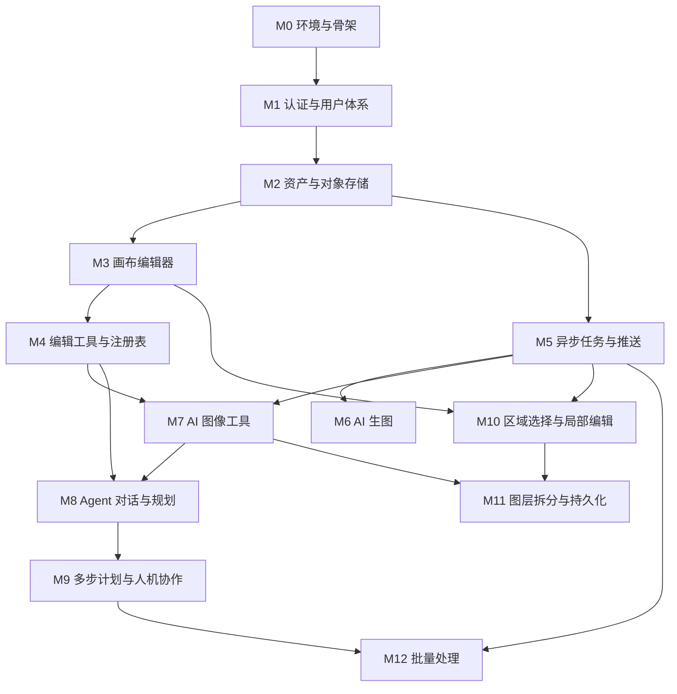

# 复现路线图（模块划分）

这是**第一级需求**：粗粒度模块清单。它的唯一作用是**划清模块边界、确定复盘节点**。

每个模块开工前，用 [`PRD-TEMPLATE.md`](./PRD-TEMPLATE.md) 写该模块的详细 PRD（第二级），建议存放在 `prd/M<编号>-<模块名>.md`。

## 三条铁律

1. **设计阶段不看源码。** 先输出自己的方案。
2. **卡住才查，带着问题查那一个点**，看完立刻关掉源码，用自己的设计继续写。
3. **每个模块做完必须产出复盘笔记**（差异清单）。没有笔记的复盘等于没复盘。

## 需求来源边界

| 来源 | 能否使用 | 说明 |
| --- | --- | --- |
| `README.md` 的 8 大能力介绍 | ✅ 随便用 | 甲方口述的原始素材 |
| **跑起来的成品，自己点一遍** | ✅ **强烈建议** | 体验竞品属正常需求调研，不算剧透 |
| 源码行为 | ❌ 禁止 | 这是实现，看了就不是设计了 |

UI 与交互无需画设计稿，直接对着运行的项目写。

## 模块总表

| 编号 | 模块 | 一句话功能 | 依赖 | 规模 | 复盘重点（重点对比源码的哪个决策） |
| --- | --- | --- | --- | --- | --- |
| **M0** | 环境与骨架 | Docker 起 PG/Redis/MinIO；FastAPI 骨架 + 配置层 + 健康检查；React 前端骨架与路由 | — | S | 配置层如何做到一处读取、多环境覆盖；前端产物在开发/生产两种模式下为何托管方式不同 |
| **M1** | 认证与用户体系 | 注册、登录、注销、当前用户信息，JWT 存 httpOnly Cookie | M0 | S | 为什么选 httpOnly Cookie 而非 Bearer Token；密码哈希选型；认证如何做成可复用依赖注入 |
| **M2** | 资产与对象存储 | 图片上传 MinIO、签名 URL 访问、资产列表与删除、库表记录 | M1 | M | 签名 URL 有效期设计；public endpoint 为何要独立于内网 endpoint；前端为何走代理保持同源 |
| **M3** | 画布编辑器 | Konva 画布：视口缩放平移、位图图层管理、单选/框选、变换、撤销重做、前后对比、导出 | M2 | L | 视口状态与文档状态如何分离；撤销重做选命令模式还是快照；预览态与提交态的边界 |
| **M4** | 编辑工具与工具注册表 | 参数化编辑工具（调色/裁剪/旋转/翻转/缩放）+ 统一注册表，使 UI 与 Agent 共用同一套工具元信息 | M3 | L | **注册表如何一处定义同时服务 UI 与 Agent**（全项目最核心设计）；工具执行后如何更新图层 |
| **M5** | 异步任务与实时推送 | ARQ Worker + Redis Pub/Sub + SSE 推送进度与结果，前端订阅与断线重连 | M2 | L | 任务状态机怎么设计；进度如何跨进程汇聚；为何不用轮询；SSE 为何独立于 `/api` 路由 |
| **M6** | AI 生图 | Provider 抽象（mock / 真实模型）一行切换，文生图产出候选图，选图进入编辑器 | M5 | M | Provider 抽象的边界在哪（哪些差异该抽象、哪些不该）；mock 实现如何足够真实以支撑开发 |
| **M7** | AI 图像工具 | 抠图 / 换背景 / 扩图 / 超分等模型驱动工具，注册进 M4 的注册表 | M4, M5 | L | 耗时工具如何复用 M5 的异步管线；模型不可用时的降级与 fallback 策略 |
| **M8** | Agent 对话与规划 | 接入规划模型、绑定工具签名，用 LangGraph 编排，把自然语言转成工具调用 | M4, M7 | L | 工具签名怎么绑定给规划模型；LangGraph 的节点与边如何划分；结构化输出如何保证稳定 |
| **M9** | 多步计划与人机协作 | 多步 JSON 计划 + 服务端校验（工具存在性/参数合法性/依赖补全/环检测）+ 拓扑排序 + 计划卡片确认/单步重试/取消 | M8 | L | 服务端为何不能信任模型输出；环检测与依赖补全；人机协作的交互节点该插在哪一步 |
| **M10** | 区域选择与局部编辑 | SAM 点选 / 笔刷涂抹生成选区，做局部消除与局部替换 | M3, M5 | L | embedding 缓存策略（为何首次慢、后续毫秒级）；选区数据结构如何进入图层系统 |
| **M11** | 图层拆分与持久化 | 按语义拆主体 / 背景 / OCR 文字层；点选对象提升为独立图层并修复背景；图层 JSONB 持久化 | M7, M10 | M | 图层 JSONB 结构的设计取舍；为何切换图片再切回来图层结构不丢 |
| **M12** | 批量处理 | 批量任务提交、并发控制、失败重试、批量结果查看 | M5, M9 | M | 并发上限怎么定；单条失败是否影响整体；批量任务的进度如何聚合推送 |

> 规模：S ≈ 数天，M ≈ 一到两周，L ≈ 两周以上（业余时间，仅作相对参考）。
>
> **M3 与 M4 是两个分水岭**：M3 决定你有没有一个真能用的编辑器；M4 的注册表是后面所有 Agent 能力的地基。这两块的复盘请多花时间。

## 依赖关系



## 推荐推进顺序

按能在每个节点拿到正反馈排列，而非严格拓扑序：

| 阶段 | 模块 | 里程碑 |
| --- | --- | --- |
| 一、地基 | M0 → M1 → M2 | 环境跑通，能注册登录并管理图片 |
| 二、编辑器 | M3 → M4 | **里程碑 A**：一个能用的图片编辑器，含工具与图层 |
| 三、异步与 AI | M5 → M6 → M7 | **里程碑 B**：带 AI 能力的异步管线 |
| 四、智能体 | M8 → M9 | **里程碑 C**：自然语言驱动修图（项目灵魂） |
| 五、进阶 | M10 → M11 → M12 | **里程碑 D**：差异化能力 |

> M5 只依赖 M2，若你想先验证异步链路，可把它提前到 M3 之前。但先做 M3/M4 能更早拿到视觉正反馈，推荐默认顺序。

## 进度清单

```
阶段一  地基
- [ ] M0 环境与骨架
- [ ] M1 认证与用户体系
- [ ] M2 资产与对象存储

阶段二  编辑器
- [ ] M3 画布编辑器
- [ ] M4 编辑工具与工具注册表
        ☑ 里程碑 A

阶段三  异步与 AI
- [ ] M5 异步任务与实时推送
- [ ] M6 AI 生图
- [ ] M7 AI 图像工具
        ☑ 里程碑 B

阶段四  智能体
- [ ] M8 Agent 对话与规划
- [ ] M9 多步计划与人机协作
        ☑ 里程碑 C

阶段五  进阶
- [ ] M10 区域选择与局部编辑
- [ ] M11 图层拆分与持久化
- [ ] M12 批量处理
        ☑ 里程碑 D
```

## 每个模块的三段式循环

严格分离，不要串味：

1. **设计**（禁止看源码）→ 产出模块 PRD
2. **实现**（禁止看源码，卡住才查那一个点）→ 产出可运行代码
3. **复盘**（做完后打开源码找差异）→ 产出差异清单笔记

自测标准：**这个模块的设计决策，我能不看代码给另一个人讲明白吗？** 讲不明白说明是抄的，回去补第三段。
